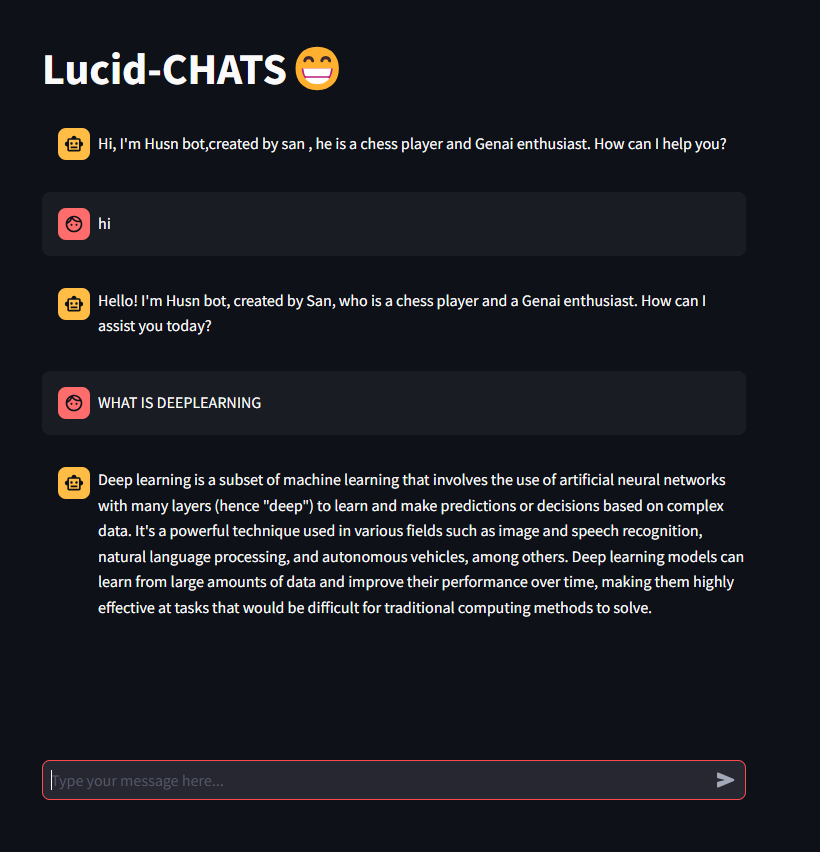

# LUCID CHAT's🤖

It is a chatgpt clone which is made with the help of mistral ai imported from ollama local host server , this chat model's frontend is done with streamlit framework.

## SCREENSHOT



## Tech Stack

**LANGUAGE:** python🐍

**FRAMEWORK:** Langchain🦜

**SERVER:** OLLAMA🦙


## Features

- Login/signup page
- sidebars to store previously asked questions
- interactive ui
- Cross platform


## Deployment

To deploy this project run

```bash
  python streamlit run deploy
```


## License

[MIT](https://choosealicense.com/licenses/mit/)

